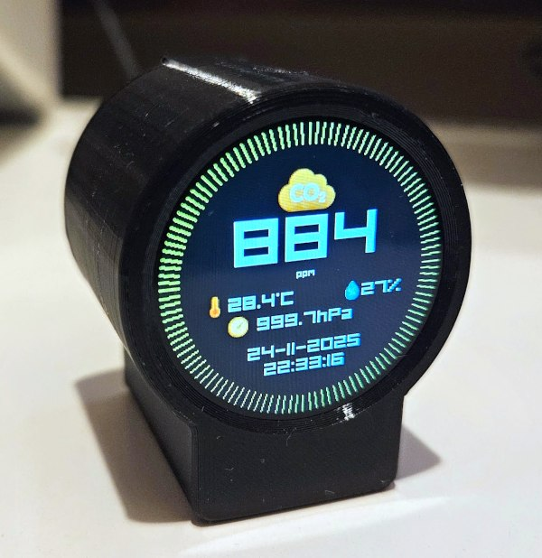

# ESP32-C3 Air Quality Monitor

A compact air quality monitoring station featuring CO₂ measurement, atmospheric pressure, temperature sensing, and a circular TFT display. Perfect for monitoring indoor air quality.





## Features

- **CO₂ Monitoring** with Sensirion SCD41 sensor
- **Atmospheric Pressure & Temperature** via BMP180 sensor
- **1.28" Round TFT Display** (240x240px, GC9A01 driver)
- **Compact Design** optimized for ESP32-C3 SuperMini
- **3D-Printable Enclosure** (F3D & STL files included)

## Connectivity

### WiFi & Access Point
The device automatically connects to your configured WiFi network. If the connection fails or no credentials are stored, it automatically starts an **Access Point mode** for easy configuration through a web interface.

- When the device is in Access Point mode a captive portal is available. After connecting to the device network (password: IntuiBase), opening any web page will automatically redirect to the web UI where you can configure Wi‑Fi, set MQTT broker details, and others.

### MQTT Support
- **MQTT Integration** with Home Assistant autodiscovery
- Publishes sensor readings (CO₂, temperature, humidity, pressure)
- Remote sensor calibration via MQTT commands
- Configurable through web UI

## User Interface

- Configure WiFi credentials
- Set up MQTT broker connection
- **Calibrate the SCD41 sensor** remotely
- Monitor real-time sensor readings
- Adjust device settings

### Display
The circular TFT display shows:
- Current CO₂ levels with color-coded warnings
- Temperature and humidity readings
- Atmospheric pressure

## Hardware Components

### Microcontroller
- **ESP32-C3 SuperMini** (recommended)
- ESP32 DevKit v1 compatible (but too large for included enclosure)

### Sensors
- **SCD41** - CO₂, temperature, and humidity sensor
- **BMP180** - Barometric pressure and temperature sensor

### Display
- **1.28" Round TFT Display**
    - Model: VER1.0
    - Resolution: 240x240px
    - Driver: GC9A01

## Pinout (ESP32-C3 SuperMini)

The device uses the following pin configuration:

| Component | Pin | ESP32-C3 GPIO |
|-----------|-----|---------------|
| I²C SDA (Sensors) | SDA | GPIO8 |
| I²C SCL (Sensors) | SCL | GPIO10 |
| TFT SCK | SCK | GPIO4 |
| TFT MOSI | MOSI | GPIO6 |
| TFT MISO | MISO | GPIO5 |
| TFT CS | CS | GPIO7 |
| TFT DC | DC | GPIO21 |
| TFT RES | RST | Not used (-1) |
| Buzzer | Signal | GPIO20 |

### Buzzer Alerts

The buzzer provides audio alerts based on CO₂ levels:
- **Normal levels**: No alert
- **Elevated CO₂**: Beeps every 60 seconds
- **High CO₂**: Beeps every 30 seconds


*Note: I²C sensors (SCD41 & BMP180) share the same bus.*

## Repository Contents

```text
├── data/cfg               # complete initial configuration: pinout, Wi‑Fi, passwords, Access Point data
│   ├── cfgap.json         # access point configuration
│   ├── cfgnetwork.json    # networking and mqtt client configuration
│   ├── cfgwifi.json       # saved Wi‑Fi credentials
│   └── cfgpins.md         # pin assignments for ESP32-C3 SuperMini
├── src/            # ESP32 source code
└── enclosure/      # 3D models (F3D + STL)
```

## Getting Started

1. Flash firmware to ESP32-C3
2. Wire components according to pinout
3. 3D print the enclosure
4. Assemble and enjoy monitoring!
